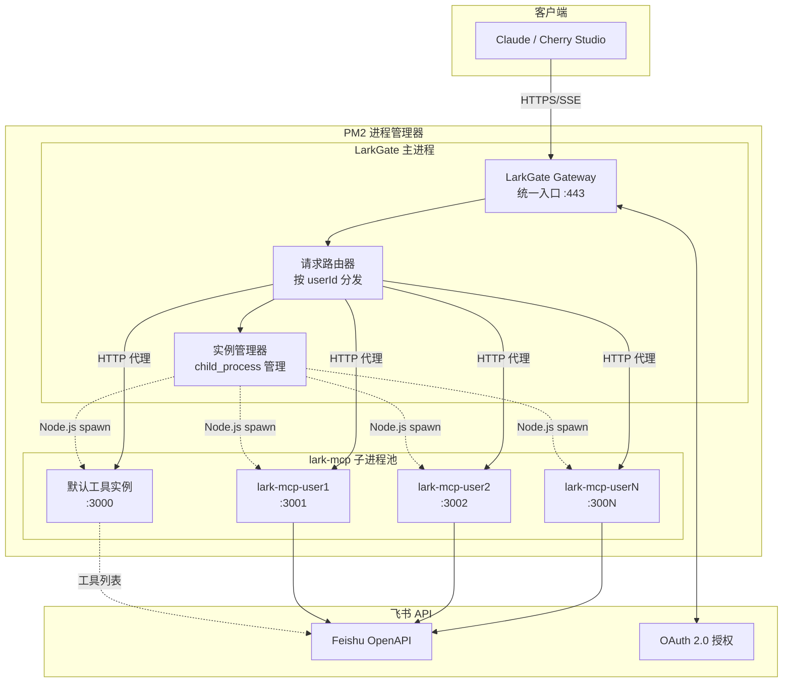
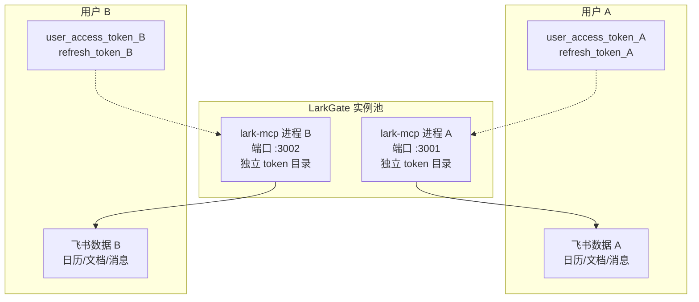

# LarkGate – 项目需求说明书

> **版本**：v0.2  **最后更新**：2025-07-02

---

## 1. 项目背景

### 1.1 核心问题

* **lark-mcp 单进程架构限制**：
  * `lark-mcp` 单个进程仅支持一个 `user_access_token`，无法原生支持多用户
  * 每个用户需要独立的 token 环境，避免权限混淆和数据泄露

* **多用户支持挑战**：
  * 需要让多名用户（多枚 token）同时调用飞书 OpenAPI
  * 需要统一入口，自动分配/复用/回收各自的 lark-mcp 实例
  * 资源管理：实例空闲超时自动关闭，节省资源

### 1.2 解决方案架构

* **1用户 = 1实例原则**：每个用户对应一个独立的 lark-mcp 实例（进程或容器），完全隔离 token
* **智能路由层**：LarkGate 作为统一入口，按 userId 将请求转发到对应实例
* **实例生命周期管理**：
  * 按需启动：用户首次请求时创建实例
  * 自动回收：空闲超时后关闭实例
  * 负载均衡：多实例间的资源调度

---

## 2. 目标与范围

* **目标**
  * 为多用户提供统一的飞书 API 调用入口
  * 实现用户级别的完全隔离（token、数据、权限）
  * 提供 OAuth 2.0 自动化身份验证，消除手动 token 管理

* **MVP 范围**
  * 多用户 lark-mcp 实例管理（进程级隔离）
  * OAuth 2.0 Authorization Code Flow（自动刷新）
  * 反向代理路由（按 userId 分发请求）
  * 实例生命周期管理（启动/停止/回收）
  * 统一日志聚合与监控

* **不在当前范围**
  * Docker 容器化部署（lark-mcp 在 Docker 环境中存在兼容性问题）
  * Kubernetes 编排（小规模无需）
  * 跨机器分布式（单机足够）

---

## 3. 系统架构

### 3.1 整体架构图



### 3.2 实例隔离模型



---

## 4. 功能需求

### 4.1 实例管理

* **实例创建**：
  * 用户首次访问时，根据 `userId` 创建专属 lark-mcp 进程
  * 分配独立端口（如 3001, 3002, ...）和 token 存储目录
  * 启动命令：`lark-mcp --oauth --port 300X --token-dir ./data/user-X/`

* **实例路由**：
  * 根据请求中的 `sessionId` 识别用户身份，查找对应的 userId
  * 将请求代理到对应用户的 lark-mcp 实例
  * 未授权用户：路由到默认实例（工具列表），返回授权提示
  * 健康检查：定期探测实例可用性

* **实例回收**：
  * 空闲检测：超过 30 分钟无请求则标记为空闲
  * 优雅关闭：发送 SIGTERM，等待进程清理资源
  * 资源释放：清理端口、内存、临时文件

### 4.2 OAuth 2.0 集成

* **授权流程**：
  * `GET /oauth/start?sessionId=xxx` - 重定向到飞书授权页
  * `GET /oauth/callback?sessionId=xxx&code=xxx` - 接收授权码，换取 token
  * 创建 sessionId → userId 映射，将 token 保存到用户专属目录

* **Token 管理**：
  * 自动刷新：`refresh_token` 有效期内自动续期 UAT
  * 加密存储：AES-256-GCM 加密 refresh_token
  * 过期处理：token 失效时引导用户重新授权

### 4.3 API 端点

* **GET `/sse`**：建立 SSE 连接，返回工具列表和 OAuth 授权链接（从默认实例获取）
* **POST `/messages?sessionId=xxx`**：接收 JSON-RPC 请求，根据 sessionId 路由到对应用户实例
* **GET `/tools`**：返回 lark-mcp 工具列表描述，供 Claude 发现可用功能
* **GET `/health`**：系统健康检查，返回基础状态信息

### 4.4 默认实例设计

* **工具列表实例**：
  * LarkGate 内部启动一个专用的 lark-mcp 实例（端口 3000）
  * 此实例无需真实 token，仅提供工具描述和参数规范
  * LarkGate 通过转发机制将工具列表暴露给 Claude
  * Claude 不直接访问此实例，所有请求通过 LarkGate 代理

* **转发机制**：
  * `GET /sse` → LarkGate 从默认实例获取工具列表，包装后返回给 Claude
  * `GET /tools` → LarkGate 转发到默认实例，获取完整工具描述
  * 未授权用户的请求 → 转发到默认实例，返回工具列表 + 授权提示

* **用户身份识别**：
  * Claude 发起请求时携带 sessionId
  * 首次请求时在 SSE metadata 中返回 OAuth 授权链接
  * 用户完成授权后，sessionId 与 userId 绑定，后续请求自动路由到专属实例

---

## 5. 非功能需求

### 5.1 性能要求

* **并发能力**：支持 10-20 个用户，每用户独立实例
* **响应延迟**：P99 < 500ms（包含实例创建时间）
* **资源限制**：
  * 单实例内存限制：256MB
  * 总实例数上限：20 个
  * CPU 使用率 < 60%

### 5.2 可靠性

* **实例隔离**：进程级隔离，单实例故障不影响其他用户
* **自愈能力**：实例崩溃时自动重启，保留用户 token
* **数据持久化**：token 和配置定期备份到磁盘

### 5.3 安全性

* **网络隔离**：仅对外暴露 443 端口，内部实例端口不对外开放
* **Token 加密**：refresh_token 使用 AES-256-GCM 加密存储
* **访问控制**：基于 sessionId/userId 的严格身份验证
* **日志脱敏**：敏感数据（token、用户ID）在日志中脱敏处理

---

## 6. 技术实现

### 6.1 技术选型

* **运行时**：Node.js 20 + TypeScript (ESM)
* **Web 框架**：Fastify 4（支持 HTTP/2 和高并发）
* **进程管理**：
  * **生产环境**：PM2 统一管理所有进程
  * **实例管理**：Node.js `child_process` 模块管理 lark-mcp 实例
  * **路由策略**：原生 Node.js 路由，无容器化开销
* **反向代理**：`http-proxy-middleware` 或自研代理层
* **存储**：文件系统 + LRU 内存缓存

### 6.2 PM2 + Node Router 设计模式

**核心设计理念**：
* **兼容性优先**：lark-mcp 在 Docker 环境中存在运行问题，采用原生进程管理
* **轻量化部署**：避免 Docker 容器化开销，使用原生 Node.js 进程管理
* **统一进程管理**：PM2 管理 LarkGate 主进程，Node.js 管理子进程实例
* **资源效率**：直接进程通信，减少网络和容器层开销

**进程架构**：
```
PM2 进程管理器
├── LarkGate 主进程 (gateway.js)
│   ├── 实例管理器 (instanceManager.ts)
│   ├── 请求路由器 (requestRouter.ts)
│   └── 子进程池
│       ├── lark-mcp 实例 1 (user-1, :3001)
│       ├── lark-mcp 实例 2 (user-2, :3002)
│       └── lark-mcp 实例 N (user-N, :300N)
└── 默认工具实例 (lark-mcp-default, :3000)
```

**关键优势**：
* **运维简化**：单机部署，无需 Kubernetes 或 Docker Swarm
* **性能优化**：原生进程通信，避免容器网络开销
* **资源控制**：PM2 提供内存限制、自动重启、日志管理
* **开发友好**：本地开发与生产环境一致的进程模型

### 6.3 目录结构

```
LarkGate/
├── src/
│   ├── index.ts                 # 主服务入口
│   ├── services/
│   │   ├── instanceManager.ts   # 实例生命周期管理
│   │   ├── requestRouter.ts     # 请求路由与代理
│   │   └── oauthService.ts      # OAuth 2.0 流程
│   └── types/
│       └── index.ts            # 类型定义
├── data/
│   ├── user-1/                 # 用户1的 token 目录
│   ├── user-2/                 # 用户2的 token 目录
│   └── instances.json          # 实例状态持久化
├── ecosystem.config.js         # PM2 配置
└── lark-mcp/           # 子模块
```

### 6.4 部署方案

**首选方案：PM2 + Node Router 进程管理**

* **生产环境（推荐）**：
  * **PM2 统一管理**：LarkGate 主进程 + 所有 lark-mcp 实例
  * **Node.js 原生路由**：使用 child_process 管理实例，无需 Docker 开销
  * **单机部署**：macOS/Linux 服务器，简化运维
  * **反向代理**：Caddy 自动 HTTPS（零配置证书管理）
  * **数据持久化**：`./data/` 本地文件存储

* **PM2 配置示例**：
  ```javascript
  // ecosystem.config.js
  module.exports = {
    apps: [{
      name: 'larkgate',
      script: './dist/gateway.js',
      instances: 1,
      max_memory_restart: '1G',
      env: {
        NODE_ENV: 'production',
        PORT: 3000,
        MAX_INSTANCES: 20,
        INSTANCE_TIMEOUT: 1800000  // 30分钟
      }
    }]
  }
  ```

* **开发环境**：
  * `pnpm dev` 启动 LarkGate
  * 自动下载并管理 lark-mcp 二进制文件
  * macOS/Linux 本地调试

* **备选方案：Docker Compose**（不推荐）
  * lark-mcp 在 Docker 环境中存在兼容性问题
  * 仅在解决 MCP Docker 兼容性问题后考虑使用
  * 增加了容器化开销，但提供更好的隔离

---

## 7. 通用要点

### 7.1 资源管理

* **独立 token 目录**：每用户一个专属目录，完全隔离存储
* **OAuth 自动刷新**：使用 `--oauth` 参数启动 lark-mcp，支持自动 token 续期
* **端口统一管理**：反向代理统一对外 443 端口，内部实例使用动态端口分配

### 7.2 监控与日志

* **资源监控**：CPU、内存、实例数量、请求QPS
* **日志聚合**：所有实例日志统一收集，按用户ID分类
* **告警机制**：实例异常、资源超限、认证失败等事件告警

### 7.3 运维策略

* **空闲实例清理**：定时任务回收长期无活动的实例
* **优雅停机**：收到停机信号时，等待所有实例完成当前请求
* **备份恢复**：定期备份用户 token 和配置，支持快速恢复

---

## 8. 任务分解与里程碑

### 8.1 M0 基础架构（2025-07-02）

* [ ] 实现 lark-mcp 实例管理器（创建/停止/监控）
* [ ] 开发请求路由器（按 userId 分发）
* [ ] 建立基础的进程通信机制

### 8.2 M1 OAuth 集成（2025-07-03）

* [ ] 实现 OAuth 2.0 授权流程
* [ ] 集成 token 自动刷新机制
* [ ] 完成用户身份识别与会话管理

### 8.3 M2 生产就绪（2025-07-04）

* [ ] 添加监控、日志、告警功能
* [ ] 实现资源限制与自动回收
* [ ] 部署方案验证与文档完善

---

## 9. 开放问题

1. **用户增长**：如果用户数超过 20 个，是否考虑升级到多机部署？
2. **实例恢复**：LarkGate 重启后如何快速恢复已有实例状态？
3. **备份策略**：用户 token 数据的备份和迁移方案？

---

## 10. 参考资料

* lark-mcp GitHub: https://github.com/larksuite/lark-openapi-mcp
* 飞书 OAuth 2.0 文档: https://open.feishu.cn/document/server-docs/authentication-management/access-token/app_access_token
* Fastify 官方文档: https://fastify.dev/
* PM2 进程管理: https://pm2.keymetrics.io/

---